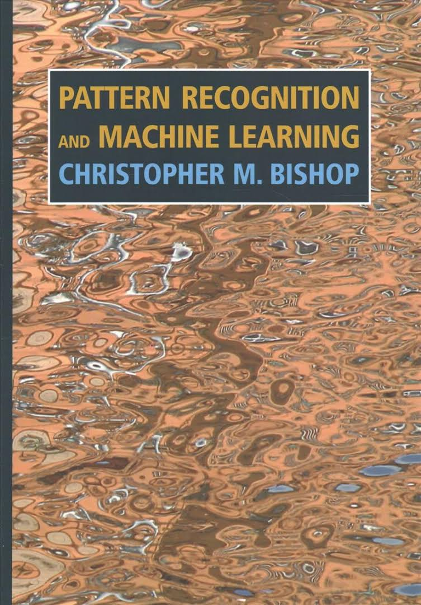
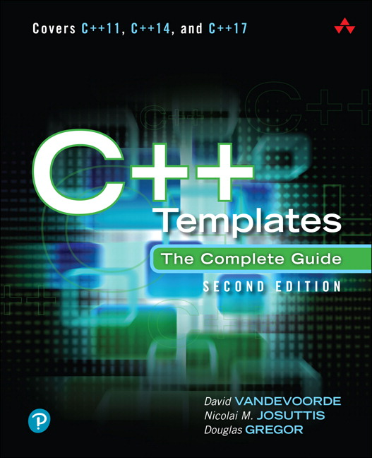

# mlpack-reinforcement-learning
Reinforcement learning implementation based on recent ideas using mlpack

# TODO List
- mlpack code compile and examine.

# DONE List
- Connection to an OpenAI Gym REST API.

# TIMELINE
- <b>Week1(11/11 ~ 11/17)</b>
    - Apprehend mlpack codebase.
    - Study c++ template metaprogramming.
    
- <b>Week2(11/18 ~ 11/24)</b>
    - Select one paper about Reinforcement learning.
    - Read and implement the algorithms.
    - Study c++ template metaprogramming.

- <b>Week3(11/14 ~ 12/1)</b>
    - Compare performance difference between existing RL algorithm and new algorithm.
    - Study c++ template metaprogramming.

# Objectives
1. Implementation of recent reinforcement learning algorithm using mlpack
2. Performance research that shows benchmark among the algorithms

# References
Papers
- [Playing Atari with Deep Reinforcement Learning](https://arxiv.org/abs/1312.5602)
- [Deep Reinforcement Learning with Double Q-learning](https://arxiv.org/abs/1509.06461)
- [Proximal Policy Optimization Algorithms](https://arxiv.org/abs/1707.06347)
- [Increasing the Action Gap: New Operators for Reinforcement Learning](https://arxiv.org/abs/1512.04860)

Books

    
    

